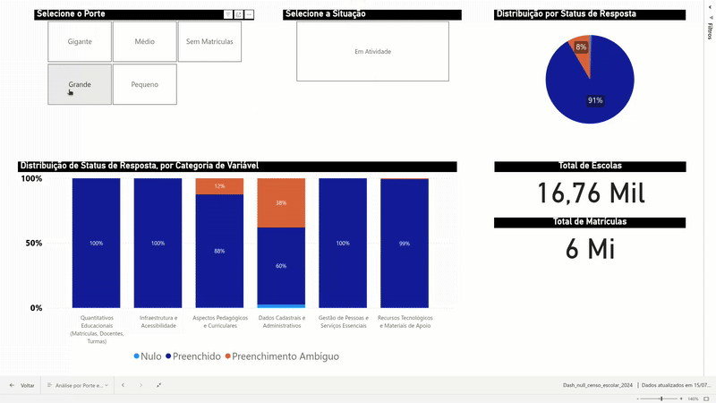

    

# 🧪 Qualidade Percebida vs. Realidade nos Dados do Censo Escolar 2024
Uma análise crítica sobre o impacto de vieses metodológicos na interpretação de dados públicos.

---

## 💥 Problemática
O Censo Escolar é a principal fonte de dados para a formulação de políticas públicas educacionais no Brasil. Análises superficiais de seus microdados frequentemente apontam para uma taxa de não preenchimento de aproximadamente **14%**, um número que poderia sugerir problemas de qualidade e comprometer a confiança em estudos e decisões baseadas nesta fonte de dados.

---

## 🎯 Objetivo
Este projeto teve como objetivo inicial investigar os fatores associados a essa aparente alta taxa de dados faltantes no Censo Escolar 2024. No entanto, a análise evoluiu para um propósito mais profundo: **avaliar criticamente o impacto da composição da base de dados na percepção de sua qualidade**, demonstrando como uma análise sem o escopo correto pode levar a conclusões equivocadas.

---
## ⭐ Principal Descoberta: O "Problema dos Nulos" é um Artefato Metodológico

A investigação revelou que a aparente alta taxa de dados faltantes (14%) não se deve a uma falha generalizada de preenchimento, mas sim à inclusão de mais de **34 mil escolas com status "Paralisada" ou "Extinta"** na base de dados padrão. A documentação do INEP confirma que a presença dessas escolas é deliberada, pois elas devem declarar seu status anualmente.

Ao isolar o universo de escolas que de fato deveriam reportar dados completos — as 135 mil escolas em **"Em Atividade"** — a taxa de não preenchimento despenca para apenas **0,69%**.

Esta descoberta muda o paradigma da análise: o principal desafio não é a qualidade do preenchimento das escolas ativas (que se mostra excelente), mas sim a **interpretação correta do universo de dados**, uma nuance não explicitamente alertada nos manuais de uso público, que pode induzir analistas a erros de avaliação.



---

## 🔎 Análise Detalhada

A jornada completa da investigação, desde o problema aparente até a descoberta da causa raiz, está documentada no arquivo abaixo.

* **1. Análise de Completude de Dados**
A narrativa da investigação que revelou o impacto das escolas inativas na qualidade percebida dos dados do Censo. **[Acesse a análise completa aqui.](./analysis/null_analysis.md)**

---

## 🛣️ A Jornada Analítica: Etapas do Projeto

A análise seguiu um processo investigativo iterativo, que se mostrou fundamental para a descoberta da real causa do problema.

1.  **ETL e Preparação dos Dados:** Os dados brutos foram tratados, e os "nulos" foram classificados em "Genuínos" e "Ambíguos" (nulos permitidos por regras de negócio).
2.  **Análise Exploratória Inicial (Geração de Hipóteses):** Utilizando um dashboard em Power BI, a investigação começou explorando a taxa de 14% de nulos. Padrões iniciais, como o "efeito rural" e as disparidades regionais, emergiram como os principais "suspeitos".
3.  **A Reviravolta Metodológica:** Uma investigação mais aprofundada, motivada por anomalias nos dados (escolas com zero matrículas), levou à análise da variável `Situação de Funcionamento`, revelando que escolas inativas eram responsáveis por mais de 80% dos nulos.
4.  **Reavaliação e Conclusão:** Com a aplicação do filtro correto (escolas "Em Atividade"), a análise foi refeita, chegando à conclusão final de que a qualidade dos dados das escolas operantes é, na verdade, muito alta (99,31% de completude).

---
## 🔬 Metodologia de Tratamento de Dados

Para conduzir uma análise de completude precisa, foi crucial diferenciar os tipos de dados ausentes, pois nem todo campo vazio representa uma falha de preenchimento.

* **O Desafio:** No Censo Escolar, muitos campos são condicionados. Por exemplo, a pergunta sobre "língua indígena" só deve ser preenchida se a escola for declaradamente indígena. Um campo vazio nesse caso não é um erro, mas um **preenchimento esperado**.

* **A Solução:** Através da lógica implementada no ETL, esses "nulos permitidos por regra de negócio" foram identificados e classificados com um valor sentinela (`-100`), recebendo o status de **"Preenchimento Ambíguo"**.

* **O Foco da Análise:** Essa separação permitiu que a análise de qualidade se concentrasse nos **"Nulos Genuínos"** – aqueles campos que deveriam ter sido preenchidos, mas não foram.

---
## 🛠️ Tecnologias Utilizadas

* **Linguagem de Programação:**
    * Python 3.12.4

* **Principais Bibliotecas Python:**
    * **Manipulação e Processamento de Dados:** Pandas, Numpy, PyArrow

* **Ambiente de Análise e Ferramentas:**
    * **Análise Interativa:** Jupyter Notebooks
    * **Dashboards Exploratórios:** Power BI Desktop

---

## 🚀 Como Executar o Projeto
1.  Clone este repositório:
    ```bash
    git clone [https://github.com/felipecsr/qualidade_dados_censo_escolar_2024.git](https://github.com/felipecsr/qualidade_dados_censo_escolar_2024.git)
    ```
2.  Navegue até o diretório do projeto:
    ```bash
    cd qualidade_dados_censo_escolar_2024
    ```
3.  Instale as dependências:
    ```bash
    pip install -r requirements.txt
    ```
4.  Execute os scripts na pasta `scripts/` para gerar as camadas de dados.

---

## 📂 Organização do repositório
- `analysis/`: Contém os documentos Markdown com as análises detalhadas.
- `data/`: Armazena as bases de dados, das camadas `raw` às `refined`.
- `powerbi/`: Arquivo `.pbix` do Power BI e GIFs.
- `scripts/`: Pipelines em Python para o ETL.
- `README.md`: Esta apresentação do projeto.
